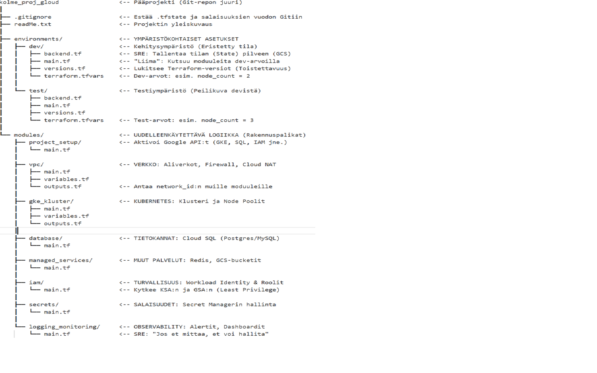

# SRE-pohjainen pilvi-infrastruktuurin hallinta (GCP)

Tämä dokumentti määrittelee, miten infrastruktuuri (Terraform) ja sovellusalusta (Kubernetes/Kustomize) jaetaan, jotta saavutetaan vakaa, turvallinen ja skaalautuva ympäristö.

## 1. Strateginen työnjako (Contracting)
SRE-mallissa työkalut pidetään niissä tehtävissä, joihin ne on tarkoitettu.
Tehtävä	Työkalu	Sijainti / Vastuu
Pilvi-infra (VPC, GKE, DB)	Terraform	Infra-repo: modules/
Kuka saa käyttää DB:tä?	Terraform	modules/iam (Workload Identity)
Salaisuuksien hallinta	Terraform	modules/secrets (Secret Manager)
Podien resurssit & terveys	Kustomize	App-repo: perus/deployment.yaml
Ympäristömuuttujat	Kustomize	App-repo: ymparistot/{env}/
## 2. Terraformin kriittiset osa-alueet
Terraformilla luodaan ennustettava "pelikenttä", joka noudattaa seuraavia seitsemää osa-aluetta:
### 1. Verkkoinfrastruktuuri (VPC & Connectivity)
Luotettavuus alkaa verkosta.
Eristys: Eri ympäristöt (dev, test, prod) pidetään omissa aliverkoissaan.
Private Service Access: Hallitut palvelut (kuten Cloud SQL) pidetään ilman julkista IP-osoitetta.
Cloud NAT: Sallitaan podien pääsy ulos (päivitykset) ilman, että ne ovat avoinna internetistä sisäänpäin.
### 2. Identiteetin hallinta (Workload Identity)
GCP:n tärkein turvaominaisuus, joka poistaa tarpeen staattisille avaintiedostoille (.json).
Kytkentä: Liitetään Kubernetes-palvelutili (KSA) ja Google Cloud -palvelutili (GSA) google_service_account_iam_binding -resurssilla.
Least Privilege: Määritetään tarkat oikeudet (esim. vain luku tiettyyn GCS-bucketiin).
### 3. Hallitut palvelut (Cloud SQL, Redis, GCS)
Suositaan Googlen ylläpitämiä palveluita operatiivisen kuorman vähentämiseksi.
Tietokannat: Automaattiset varmuuskopiot ja HA-asetukset (High Availability).
Välimuistit: Memorystore (Redis) sovelluksen suorituskyvyn optimointiin.
### 4. Havainnointi (Monitoring & Alerting)
"Jos et näe sitä, et voi korjata sitä."
Log-sinkit: Ohjataan kriittiset lokit (GKE, Audit) BigQueryyn tai Cloud Storageen.
Alert-politiikat: Automaattiset hälytykset (CPU-piikit, 5xx-virheet, muistin loppuminen).
Uptime Checks: Varmistetaan ulkoisella tarkistuksella, että sovellus vastaa internetiin.
### 5. DNS ja Sertifikaatit (Edge)
Automatisoidaan liikenteen suojaus.
Cloud DNS: Hallitaan verkkotunnuksia (esim. api.dev.yritys.fi).
Managed Certificates: Pyydetään Googlea hoitamaan SSL-sertifikaattien elinkaari ja uusiminen automaattisesti.
### 6. Artifact Registry (Docker-repositorio)
Turvallisuus: Luodaan rekisterit ja annetaan GKE-klusterille lukuoikeudet.
Siivous: Määritetään säännöt vanhojen (esim. >30 pv) kehitysversioiden automaattiseen poistoon.
### 7. Terraform State Management
Remote Backend: Tallennetaan terraform.tfstate GCS-bucketiin, jotta tiimi voi työskennellä yhdessä.
State Locking: Estetään päällekkäiset muutokset, jotka voisivat korruptoida infrastruktuurin tilan.

## 3. SRE-suositukset Kubernetes-sovellukselle
Kun infrastruktuuri on valmis, sovellusmanifestien (Kustomize) tulee tukea ennustettavuutta:
Resurssirajat: Asetetaan requests ja limits (SRE-suositus: Memory request = limit).
Health Probes: Määritetään livenessProbe ja readinessProbe automaattista palautumista varten.
ConfigMapGenerator: Käytetään Kustomizen generaattoreita, jotta podit käynnistyvät uudelleen, kun konfiguraatio muuttuu.
## 4. Tiedostorakenne (Best Practice)

Käytetään Environments/Modules -rakennetta selkeyden vuoksi:

C:\TERRAFORM
┣━ environments/        # Ympäristökohtaiset asetukset
┃  ┗━ dev/              # (backend.tf, main.tf, terraform.tfvars, versions.tf)
┗━ modules/             # Uudelleenkäytettävät rakennuspalikat
   ┣━ project_setup/    # API:iden aktivointi
   ┣━ vpc/              # Verkko ja NAT
   ┣━ gke_kluster/      # Klusterin hallinta
   ┣━ database/         # Cloud SQL
   ┣━ iam/              # Workload Identity
   ┗━ logging_monitoring/ # Alertit ja Dashboardit
Use code with caution.

## Miksi tämä jako ? (SRE-perustelut)
Modulaarisuus: Jos haluat muuttaa vain verkon asetuksia, muokkaat modules/vpc -koodia. Se ei sotke GKE-klusterin logiikkaa.
Uudelleenkäytettävyys: dev ja test käyttävät samoja moduuleita, mutta eri syötteillä (esim. dev-ympäristöön pieni tietokanta, test-ympäristöön isompi).
Riippuvuuksien hallinta: Moduulien avulla voit pakottaa järjestyksen (esim. GKE ei voi syntyä ennen kuin VPC on valmis).

Miten tiedostot kannattaa jakaa moduulin sisällä?
Jokaisessa moduulissa (esim. modules/iam) tulisi olla vähintään nämä kolme tiedostoa:
main.tf: Varsinainen logiikka (resurssit).
variables.tf: Määritelmät sille, mitä tietoja moduuli tarvitsee (esim. project_id, region).
outputs.tf: Tiedot, joita muut moduulit tarvitsevat (esim. VPC-moduuli antaa ulos network_id:n, jota GKE-moduuli käyttää).

Yhteenveto rakenteesta (Checklist suoritettu):
Eristys: Dev ja Test ovat täysin erillisiä (environments).
Uudelleenkäytettävyys: Logiikka on jaettu moduuleihin (modules).
Turvallisuus: IAM, Secrets ja Workload Identity on huomioitu.
Skaalautuvuus: Voit lisätä uusia hallittuja palveluita (Redis, SQL) helposti.
Jatkuvuus: backend.tf varmistaa, että tila on pilvessä ja tiimi voi tehdä yhteistyötä.

## Kommentit, jotka selittävät jokaisen osan vastuun.

"# google_cloud_terraform" 
